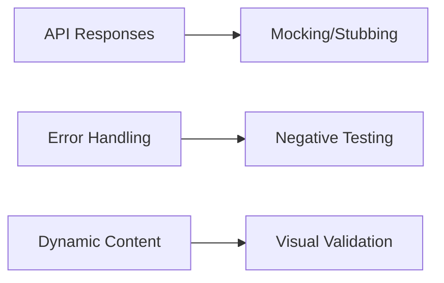
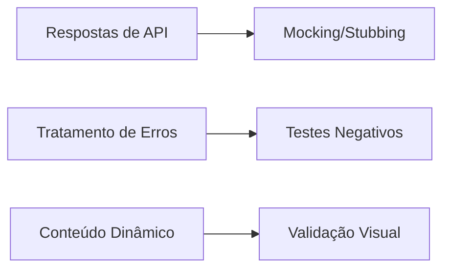

# ⛅ Weather App (JavaScript)  
Weather application with external API integration | Aplicação meteorológica com integração de API externa  

[EN-US](#en) | [PT-BR](#pt-br)  

---

## 🛠️ Technical Skills Demonstrated  
- **API Consumption**: Fetch data from OpenWeatherMap  
- **Async Operations**: Handling API responses  
- **Error Handling**: Network failure management  
- **Dynamic Rendering**: UI updates based on data  
- **User Input Processing**: City search validation  

## 🎯 Relevance for QA Automation  

API Testing Foundations:

Response schema validation

Error code handling (404, 500)

Data-driven UI updates

Failure Simulation:
Handling network errors = testing application resilience

Visual Regression:
Dynamic elements = candidates for visual testing tools

▶️ [Live Demo](https://derre3.github.io/weather-app/)

---

🛠️ Habilidades Técnicas Demonstradas
Consumo de API: Dados do OpenWeatherMap

Operações Assíncronas: Tratamento de respostas

Tratamento de Erros: Gerenciamento de falhas de rede

Renderização Dinâmica: Atualizações de UI baseadas em dados

Processamento de Inputs: Validação de busca por cidades

🎯 Relevância para Automação de QA

Fundamentos de Teste de API:

Validação de esquema de respostas

Tratamento de códigos de erro

Atualizações de UI baseadas em dados

Simulação de Falhas:
Lidar com erros de rede = testar resiliência da aplicação

Regressão Visual:
Elementos dinâmicos = candidatos a testes com ferramentas visuais

▶️ [Demo Online](https://derre3.github.io/weather-app/)

---

🔧 Tech Stack | Tecnologias
JavaScript REST API Async/Await CSS Grid
